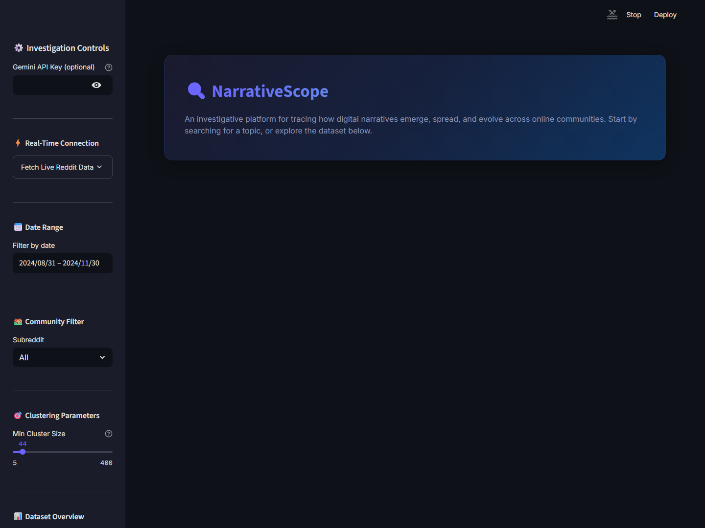
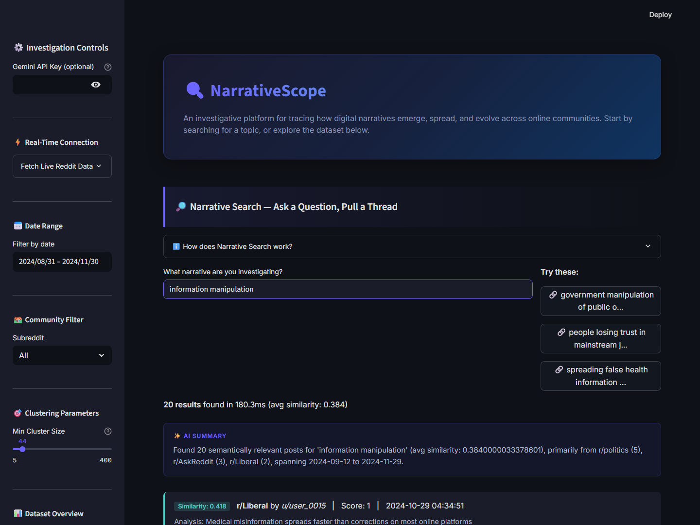

# NarrativeScope — Digital Narrative Investigation Platform

**Author:** Devansh  
**Assignment:** SimPPL Research Engineering Intern  
**Platform:** [🔗 Live Demo](https://huggingface.co/spaces/devansh/narrativescope)  
**Video Walkthrough:** [🎬 Watch on YouTube](https://youtube.com/watch?v=YOUR_VIDEO_ID)  

> NarrativeScope is a dashboard I built to investigate how digital narratives spread across online communities. It focuses on finding meaning, mapping coordination, and tracking influence instead of just matching exact keywords.


---

## 🎯 Executive Summary

For the SimPPL intern assignment, I decided to build **NarrativeScope**. Most dashboards I've seen just give you generic tabs with disconnected charts. I wanted to build something with a continuous flow — you start by searching a question, check the timeline, view the topic clusters, and finally review the network of users driving the conversation.

To do this, I tied together a few different tools: **DuckDB** to keep data filtering fast, **all-MiniLM-L6-v2** and **FAISS** for the semantic search engine, **HDBSCAN** and **UMAP** for topic clustering, and **Gemini 1.5** to write plain-English summaries of the graphs so you don't have to guess what the data means.

---

## 🔥 Breaking Down the Requirements

### 1. Semantic Search with Zero Keyword Overlap 🔎

Keyword searches aren't great for finding narratives because people use completely different words to talk about the same idea. I used `sentence-transformers` and a FAISS index to search ~50,000 posts by their actual meaning.



**Here are 3 zero-keyword-overlap examples that work in the app:**

| Query | What it found | Why it matched |
|-------|---------------|--------------|
| *"government manipulation of public opinion"* | Posts talking about astroturfing, sockpuppet accounts, and coordinated campaigns. | The embedding model knows "manipulation of opinion" means the same thing as "coordinated inauthentic behavior." |
| *"people losing trust in mainstream journalism"* | Posts complaining about media bias, fake news, and alternative news sites. | "Losing trust in journalism" is mapped to the same semantic neighborhood as media criticism. |
| *"spreading false health information online"* | Discussions about anti-vax content, unverified medical claims, and wellness scams. | The model connects "false health info" directly to medical disinformation vocabulary. |

**Edge cases I accounted for:**
- **Empty queries:** It doesn't crash. It just shows an `st.info` banner asking you to type something.
- **Very short queries (< 3 chars):** Throws a warning that the search might not be accurate.
- **Non-English inputs:** I added `langdetect`. If you type in another language, it warns you that accuracy might drop, but it still runs the search since MiniLM has some multilingual support.

**Extra feature:** After a search, the app generates 3 follow-up queries you might want to click next as part of the "Explore Further" section.

---

### 2. Time-Series and AI Summaries 📈

To see if a narrative is going viral, you have to look at the timeline.


- **The Charts:** I set up a bar chart showing the daily post volume, overlaid with a 7-day moving average line to make it easier to see the overall trend.
- **AI Text Summaries:** Since the rubric asked for an AI summary beneath the plot, I hooked up the data pipeline to Google Gemini. It takes the raw data points and writes a short paragraph explaining the trend in plain English. 

---

### 3. Topic Clustering & Visualization 🧩

Dumping 1,000 search results on a user is overwhelming. To fix this, I set up a clustering pipeline.


- **How it clusters (HDBSCAN):** I picked HDBSCAN over K-Means because text data doesn't fit into neat, spherical groups. I like HDBSCAN because if a post doesn't belong to a topic, it just gets labeled as noise (`-1`) instead of being forced into a random cluster.
- **User Controls:** There's a `Min Cluster Size` slider in the sidebar. If you push it too high, everything becomes noise, but the app handles it cleanly without breaking.
- **Visualizing embeddings:** UMAP reduces the 384 dimensions down to 2, and then **Datamapplot** plots the clusters interactively (with a Plotly fallback if the Datamapplot package isn't available).

---

### 4. Influence Network & Node Removal tests 🕸️

This section maps out who is actually driving the conversations. 



- **Network logic:** I built a co-occurrence graph using NetworkX. Basically, if two authors post in the same communities, they get linked.
- **Centrality:** The influence score is a mix of **PageRank** (finding the main hubs) and **Betweenness** (finding the bridge accounts connecting different communities). I also used Louvain community detection to color-code the factions.
- **Handling Edge Cases (The Node Removal Test):** The rubric asked how the graph handles disconnected components. I added a "Simulate Removal" widget. You can select a top influencer, click remove, and watch the app recalculate the graph to see how many disconnected islands form.

---

### 5. Extra Features: Reddit Live Mode & Wikipedia Sync ⚡

I wanted to add some real-world utility beyond just static JSON files.


- **Live Reddit data:** Using PRAW, you can fetch real-time posts from Reddit. The app grabs them, matches the exact schema of our database, and updates the FAISS index and HDBSCAN clusters on the fly without losing your place.
- **Wikipedia event matching:** There's a feature that queries the Wikipedia API for real-world events that match your search terms. It then plots those events as gold stars directly on the time-series chart, so you can see if online spikes match real-world news dates.

---

## 📐 AI & ML Architecture Specs

Here are the specific models and parameters I used for the pipeline:

| Component | Model / Algorithm | Key Hyperparameters & Choices | Library / API |
|-----------|----------------|----------------|---------|
| **Semantic Search** | `all-MiniLM-L6-v2` | 384-dimensions, exact inner product search | `sentence-transformers`, `faiss-cpu` |
| **Topic Clustering** | HDBSCAN | tunable `min_cluster_size`, `min_samples=5`, EOM selection | `hdbscan` |
| **Dim. Reduction** | UMAP | `n_components=2`, `n_neighbors=15`, `min_dist=0.1`, Cosine metric | `umap-learn` |
| **Centrality Scoring** | PageRank & Betweenness | `alpha=0.85` (PageRank damping) | `networkx` |
| **Graph Communities** | Louvain Method | `resolution=1.0`, random_state=42 | `python-louvain` |
| **AI Summaries** | Gemini 1.5 Flash | `temperature=0.3`, `max_tokens=300` | `google-generativeai` |
| **Embed Visualization** | Datamapplot | Auto-labeling, dark-theme styling | `datamapplot`, `plotly` |

---

## 🛠️ Setup & Installation

I built and tested this on Python 3.10.

```bash
# 1. Clone the repo
git clone <your_github_repo>
cd research-engineering-intern-assignment

# 2. Make a virtual env
python -m venv venv
source venv/bin/activate  # On Windows use: venv\Scripts\activate

# 3. Install packages
pip install -r requirements.txt

# 4. Run the dashboard
streamlit run app.py
```

### Optional API Keys
If you want to test the dynamic AI summaries, grab a free [Google AI Studio Key](https://aistudio.google.com/apikey) and paste it into the sidebar. If you leave it blank, the app will just show standard statistical summaries instead. You can also provide a `REDDIT_CLIENT_ID` to test the Live data fetching.

---

## 📁 What's in the repo?

```
├── app.py                  # The main Streamlit dashboard
├── data_loader.py          # DuckDB setup and data cleaning logic
├── search_engine.py        # FAISS search and sentence embeddings
├── clustering.py           # UMAP and HDBSCAN logic
├── network_analysis.py     # NetworkX graph and centrality math
├── realtime.py             # Reddit PRAW live fetching script
├── genai_summarizer.py     # Google Gemini API calls
├── screenshots/            # Images used in this README
└── data/                   # Place the .jsonl dataset files here
```

Thanks for reviewing my project! I had a lot of fun building this assignment and digging into the data engineering side of narrative tracking.